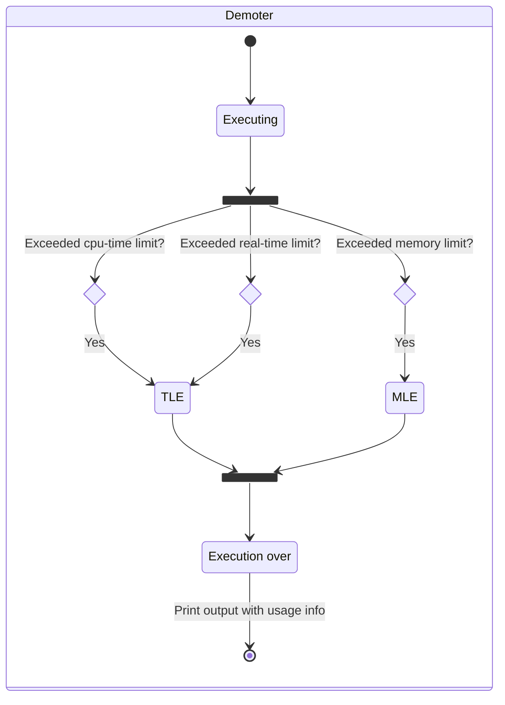

# Demoter State Diagram

```mermaid
stateDiagram-v2

state Demoter {

  state d_is_over_cpu <<choice>>
  state d_is_over_mem <<choice>>
  state d_is_over_time <<choice>>
  state d_join_executed <<join>>
  state d_fork_executing <<fork>>

  d_executing: Executing
  d_executed: Execution over

  d_tle: TLE
  d_mle: MLE

  [*]-->d_executing 
  d_executing-->d_fork_executing
  d_fork_executing-->d_is_over_cpu: Exceeded cpu-time limit?
  d_is_over_cpu-->d_tle: Yes
  d_fork_executing-->d_is_over_time: Exceeded real-time limit?
  d_is_over_time-->d_tle: Yes
  d_fork_executing-->d_is_over_mem: Exceeded memory limit?
  d_is_over_mem-->d_mle: Yes
  d_tle-->d_join_executed
  d_mle-->d_join_executed

  d_join_executed-->d_executed
  d_executed-->[*]: Print output with usage info 
}

```