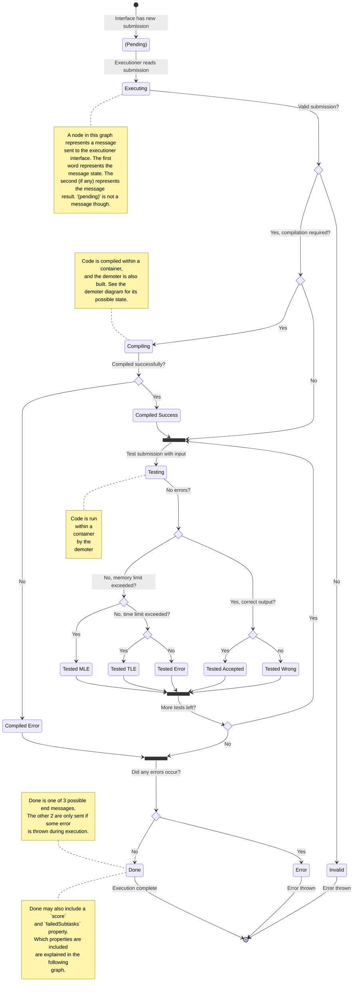
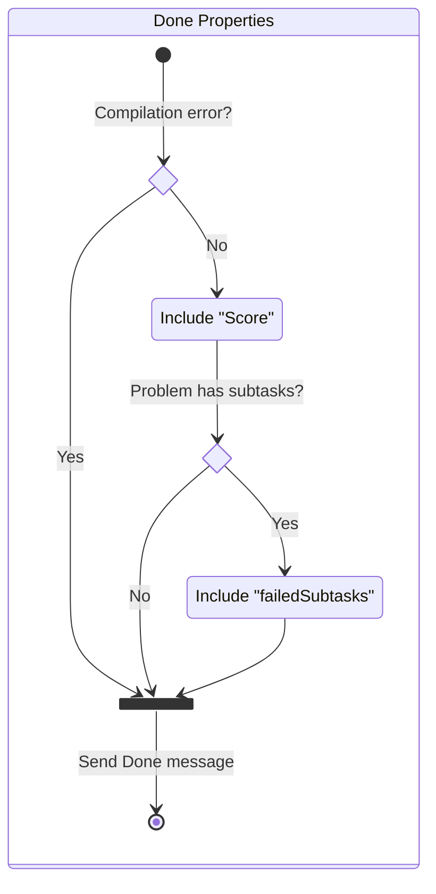

# Executioner State Diagram

This represents a diagram of the messages sent in the executioner to the
executioner interface. This was created to help visualize the state of the
executioner and what needs to be tested.

Note that the messages sent by the executioner to the interface does not
neccessarily represent the state updated in whatever the executioner interfaces
with. In the case of the firestore interface, only the testing and tested
messages are added directly to a collection. The rest of the messages, for
example, are used to update other fields.

